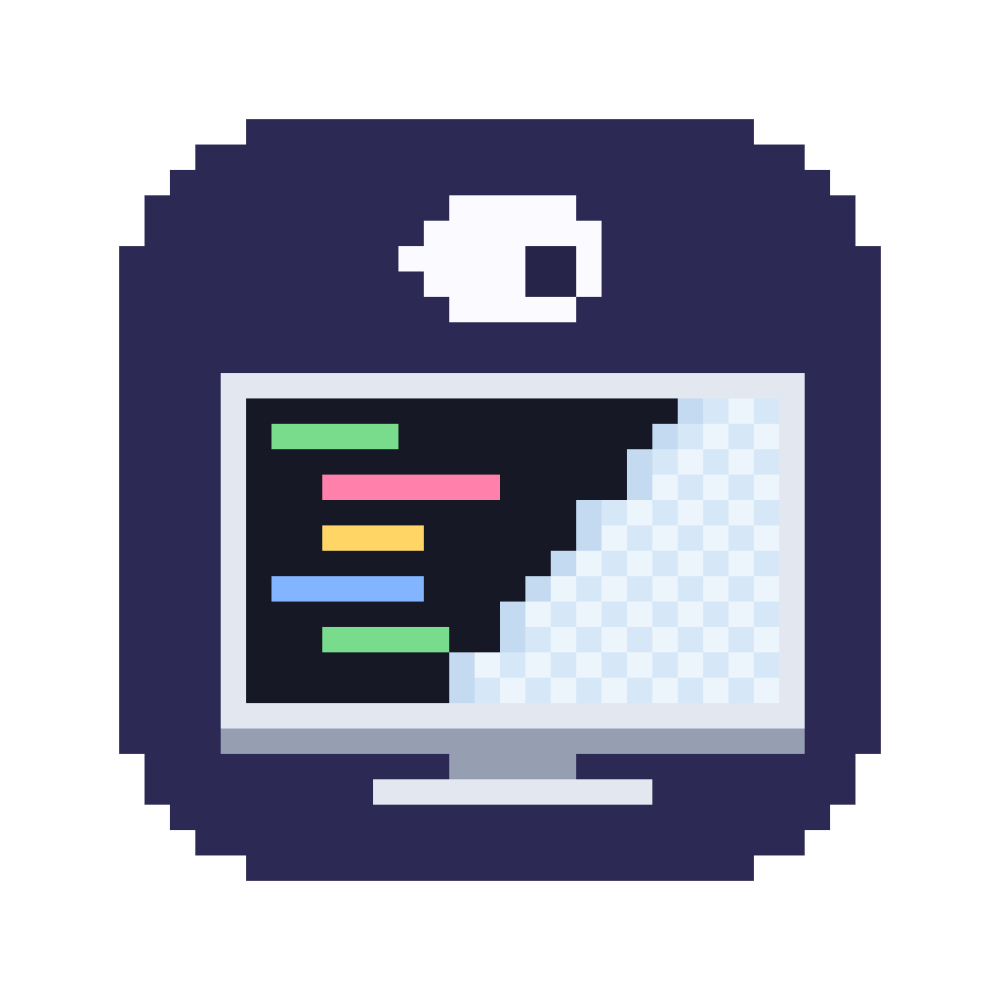
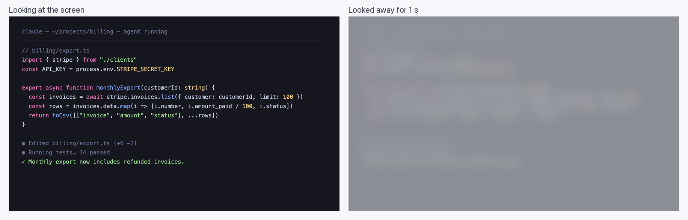

<p align="center"></p>

<h1 align="center">Glaze</h1>
<p align="center"><strong>Look away and your screen glazes over.</strong></p>
<p align="center">Look back and it clears. A camera-based privacy screen for the Mac that keeps working while you don't.</p>

<p align="center">
  <a href="LICENSE"></a>
  
  
  
</p>

<p align="center">
  <a href="README.zh-CN.md">简体中文</a> ·
  <a href="#quick-start">Quick start</a> ·
  <a href="#how-it-decides">How it decides</a> ·
  <a href="#controls">Controls</a> ·
  <a href="#build-with-us">Build with us</a>
</p>

Your coding agent keeps working when you step away from the desk. **Glaze keeps your screen from being read while it does.**

The built-in camera checks whether you're facing the screen. Turn your head, or get up and walk off, and every display turns to frosted glass: shapes and colors show through, text doesn't. Face the screen again and it clears on the next frame.

**No account. No network. No frames saved.**

> **Early alpha.** It has been tuned by one person at one desk. Expect to calibrate once, and see [Limits](#limits) for what still misfires.

<p align="center"></p>
<p align="center"><sub>The right half is a simulation for this README. The real frost is macOS's own frosted material and follows light and dark mode.</sub></p>

## How it decides

| You... | Glaze |
|---|---|
| turn your head left or right past 20° | frosts after 1 s |
| tilt your head up past 10° | frosts after 1 s |
| leave the camera's view | frosts after 1 s |
| look down at the keyboard or your phone | stays clear |
| face the screen again | clears on the next frame |

The 1-second delay keeps a quick glance aside from triggering it. Angles are measured from your own "facing the screen" pose, which you set with **Calibrate**. That's also how an external monitor to the side of the laptop camera works: calibrate while facing the monitor.

## What to try

| Try this | What you should see |
|---|---|
| Turn to look at something beside your desk | Frost after about a second |
| Look down and type a few lines | Nothing: typing never frosts |
| Stand up and walk away | Frost, and it stays until you're back in front of the screen |
| Press `Esc` while frosted | Clears at once and stays clear until you face the screen again |

## Quick start

You need macOS 14 or newer, a camera, and the Xcode command-line tools (`xcode-select --install`).

### Option A: let your coding agent set it up

Paste this into Claude Code, Codex or any assistant that can use a terminal:

```text
Help me set up https://github.com/Longado/glaze on this Mac. Read README.md
first. Check that the Xcode command-line tools are installed, clone the repo,
run ./build.sh and open Glaze.app. Tell me when macOS asks for camera access,
then remind me to press Control-Option-K to calibrate while facing the screen.
```

### Option B: do it yourself

```sh
git clone https://github.com/Longado/glaze.git
cd glaze
./build.sh
open Glaze.app
```

The app is ad-hoc signed, not notarized. If macOS blocks the first launch, right-click `Glaze.app` → **Open**. Allow camera access, then press `⌃⌥K` and face the screen for 4 seconds.

## Controls

The menu-bar icon can end up hidden behind the notch, so everything is also on hotkeys and on the Dock icon's right-click menu.

| Key | Action |
|---|---|
| `Esc` | clear the frost now (only grabbed while frosted or calibrating) |
| `⌃⌥K` | calibrate: face the screen for 4 s |
| `⌃⌥X` | pause / resume |
| `⌃⌥B` | preview the frost for 2 s |
| `⌃⌥Q` | quit |

## Privacy

The camera is read four times a second. Face angles are computed with Apple's on-device Vision framework and each frame is dropped right after. Nothing is written to disk except your calibration, and the app makes no network requests. The camera is off while the screen is locked or asleep and while Glaze is paused.

## Limits

- Default angles come from one person at one desk. If it frosts when it shouldn't, or doesn't when it should, calibrate first; the thresholds are constants at the top of `Calib.swift`.
- Leaning in close to a camera below the screen can read as tilting your head up.
- In dim light the face detector loses you more often, and "no face" counts as looking away.
- It uses about 17% CPU in `top` on the machine it was built on. That's higher than it should be, and the cause isn't pinned down yet.

## Build with us

The question behind Glaze: **can a camera tell "I'm working" from "I've looked away" well enough that you forget it's there?** You don't need to solve all of it to help.

| You enjoy… | A useful contribution |
|---|---|
| Trying things at your own desk | A `GLAZE_DEBUG` log of a false frost or a missed turn, with camera position and lighting |
| macOS and Swift | Bringing the CPU use down, or a menu-bar icon that survives the notch |
| Computer vision | A better "is this person looking at the screen" signal than head angle |
| Design | Frost styles, the calibration prompt, the icon |
| Writing | Setup notes for other Mac setups, translations |

Open an issue or a pull request.

## Development

```sh
swiftc Calib.swift tests/main.swift -o /tmp/calibcheck && /tmp/calibcheck   # calibration logic check
open --env GLAZE_DEBUG=1 --stderr /tmp/glaze.log Glaze.app && tail -f /tmp/glaze.log   # live yaw/pitch readout
python3 icon/make_icon.py   # regenerate the pixel icon (needs Pillow)
```

## License

MIT
