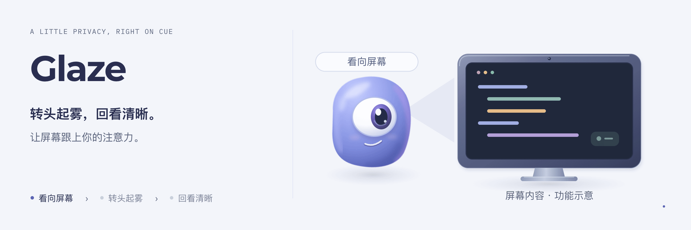

<p align="center"></p>

<h1 align="center">Glaze</h1>
<p align="center"><strong>你一转头，屏幕就蒙上一层磨砂。</strong></p>
<p align="center">转回来就清楚了。用摄像头判断你在不在看屏幕，给人走开了、电脑还在干活的 Mac 用。</p>

<p align="center">
  <a href="LICENSE"></a>
  
  
  
</p>

<p align="center">
  <a href="README.md">English</a> ·
  <a href="#快速开始">快速开始</a> ·
  <a href="#怎么判断你没在看">怎么判断</a> ·
  <a href="#操作">操作</a> ·
  <a href="#一起做">一起做</a>
</p>

<p align="center">
  
</p>
<p align="center"><sub>功能主题插画 · <a href="docs/media/glaze-poster.png">静态版</a> · <a href="docs/media/glaze-motion.mp4">MP4</a> · <a href="docs/media/glaze-style-prompt.md">生图参考与提示词</a></sub></p>

你起身离开座位，AI 还在终端里接着写代码。**Glaze 让路过的人看不清你屏幕上写的是什么。**

它用 Mac 自带的摄像头判断你是不是正对着屏幕。你转过头，或者起身走开，所有屏幕都会变成磨砂玻璃：轮廓和颜色还看得见，字看不清。转回来，下一帧就恢复。

**不用注册账号，不联网，不存画面。**

> **早期版本。** 目前只在一个人、一张桌子上调过参数。第一次用要校准一下，还会误判的情况见[已知问题](#已知问题)。

<p align="center"></p>
<p align="center"><sub>右半边是为 README 做的模拟图。真实效果用的是 macOS 系统自带的磨砂材质，会跟着浅色、深色模式变。</sub></p>

## 怎么判断你没在看

| 你…… | Glaze |
|---|---|
| 头往左或往右转超过 20° | 1 秒后磨砂 |
| 抬头超过 10° | 1 秒后磨砂 |
| 离开摄像头画面 | 1 秒后磨砂 |
| 低头看键盘、看手机 | 不磨砂 |
| 转回来正对屏幕 | 下一帧就恢复 |

等 1 秒再磨砂，是为了让你快速瞟一眼旁边时不触发。角度从你自己"正对屏幕"的姿势算起，这个姿势用**校准**记下来。所以外接显示器放在笔记本摄像头旁边也能用：对着外接显示器校准就行。

## 可以试试这些

| 试试 | 应该看到 |
|---|---|
| 转头看桌子旁边的东西 | 大约一秒后磨砂 |
| 低头打几行字 | 没反应：打字永远不会触发 |
| 站起来走开 | 磨砂，一直保持到你回到屏幕前 |
| 磨砂时按 `Esc` | 立刻清除，并且保持清楚，直到你重新正对屏幕 |

## 快速开始

需要 macOS 14 或更新版本、一个摄像头，以及 Xcode 命令行工具（`xcode-select --install`）。

### 方式 A：让你的 AI 帮你装

把下面这段贴进 Claude Code、Codex 或其他能用终端的 AI 工具：

```text
帮我在这台 Mac 上装好 https://github.com/Longado/glaze。先读 README.md，
检查有没有装 Xcode 命令行工具，把仓库克隆下来，运行 ./build.sh，然后打开
Glaze.app。系统要摄像头权限的时候告诉我，最后提醒我正对屏幕按 Control-Option-K
校准一次。
```

### 方式 B：自己装

```sh
git clone https://github.com/Longado/glaze.git
cd glaze
./build.sh
open Glaze.app
```

这个程序没有经过苹果公证。如果第一次打开被系统拦住，右键 `Glaze.app` → **打开**。允许摄像头权限，然后按 `⌃⌥K`，正对屏幕坐 4 秒完成校准。

## 操作

菜单栏图标可能被刘海挡住，所以所有操作都有快捷键，在 Dock 图标上右键也能找到。

| 按键 | 作用 |
|---|---|
| `Esc` | 立刻清除磨砂（只在磨砂或校准时占用 Esc） |
| `⌃⌥K` | 校准：正对屏幕 4 秒 |
| `⌃⌥X` | 暂停或恢复 |
| `⌃⌥B` | 预览磨砂效果 2 秒 |
| `⌃⌥Q` | 退出 |

## 隐私

摄像头每秒读 4 帧，用苹果本机的 Vision 框架算出脸的角度，每一帧用完就丢。除了校准结果，什么都不写到硬盘，也不发任何网络请求。锁屏、休眠、暂停的时候，摄像头是关着的。

## 已知问题

- 默认角度只在一个人、一张桌子上调过。该磨砂的时候不磨砂，或者不该磨砂的时候磨砂了，先校准一次。阈值是 `Calib.swift` 开头的几个常量。
- 摄像头在屏幕下方时，人往前凑可能被当成抬头。
- 光线暗的时候更容易认不出脸，而认不出脸会被当成没在看。
- 在开发它的那台 Mac 上，`top` 显示 CPU 占用大约 17%。这偏高了，原因还没查清。

## 一起做

Glaze 背后的问题是：**摄像头能不能把"我在干活"和"我转开了"分得足够准，准到你忘了它在那儿？** 不用把整件事都解决，也能帮上忙。

| 你喜欢…… | 可以贡献 |
|---|---|
| 在自己桌上试东西 | 一次误判或漏判的 `GLAZE_DEBUG` 日志，附上摄像头位置和光线情况 |
| macOS 和 Swift | 把 CPU 占用降下来，或者做一个不会被刘海挡住的菜单栏图标 |
| 计算机视觉 | 比头部角度更准的"这个人在不在看屏幕"的判断 |
| 设计 | 磨砂样式、校准提示、图标 |
| 写作 | 其他 Mac 环境的安装说明、翻译 |

欢迎提 issue 或 pull request。

## 开发

```sh
swiftc Calib.swift tests/main.swift -o /tmp/calibcheck && /tmp/calibcheck   # 校准逻辑检查
open --env GLAZE_DEBUG=1 --stderr /tmp/glaze.log Glaze.app && tail -f /tmp/glaze.log   # 实时看角度读数
python3 icon/make_icon.py   # 重新生成像素图标（需要 Pillow）
```

## 许可证

MIT
